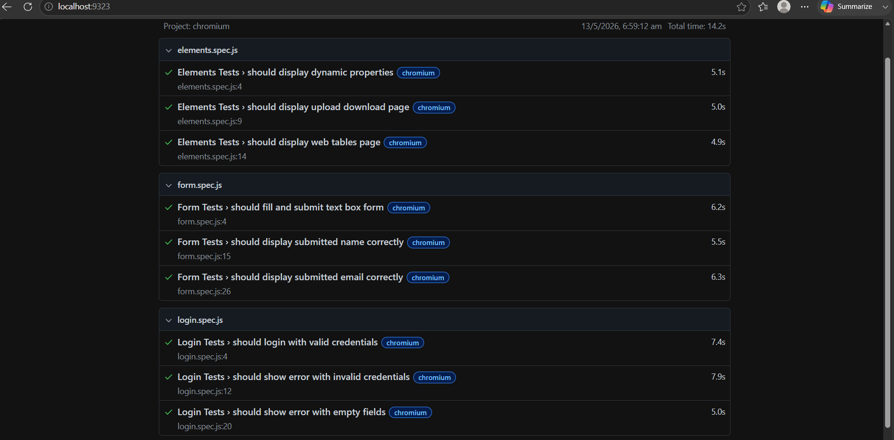

# playwright-qa-project
# Playwright QA Automation Framework

## Overview
End-to-end test automation framework built with Playwright and JavaScript following Page Object Model design pattern. Tests cover login, form submission and UI element validation on a real web application.

## Tools Used
- Playwright
- JavaScript
- Node.js
- Page Object Model POM
- GitHub

## Project Structure
- tests/login.spec.js — Login test scenarios
- tests/form.spec.js — Form submission tests
- tests/elements.spec.js — UI element tests
- pages/LoginPage.js — Page Object Model

## Test Coverage

| Module | Tests | Status |
|---|---|---|
| Login Tests | 3 | Pass |
| Form Tests | 3 | Pass |
| Elements Tests | 3 | Pass |
| Total | 9 | All Pass |

## Test Scenarios

### Login Tests
- Valid login with correct credentials
- Invalid login with wrong password
- Empty field validation

### Form Tests
- Fill and submit complete form
- Verify submitted name displays correctly
- Verify submitted email displays correctly

### Elements Tests
- Dynamic properties page loads
- Upload download page loads
- Web tables page loads

## Test Results

## How To Run
- npm install
- npx playwright install
- npx playwright test
- npx playwright show-report

## What I Learned
- Writing end to end tests using Playwright
- Page Object Model design pattern
- Locator strategies in Playwright
- Running tests across multiple browsers
- Generating HTML test reports

## Author
Vishnu Durga — QA Engineer
GitHub: github.com/VishnuDurgaCse
